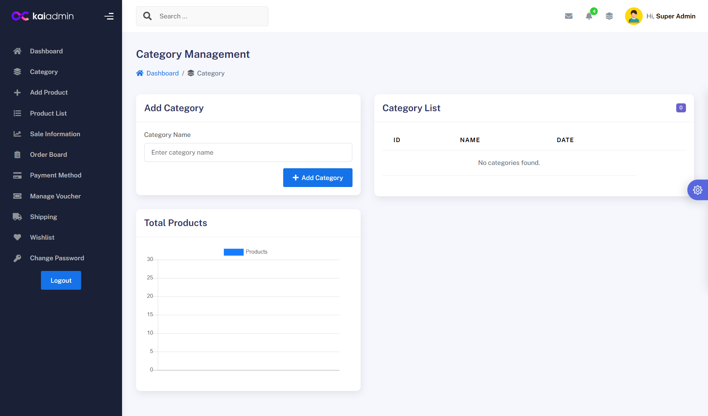
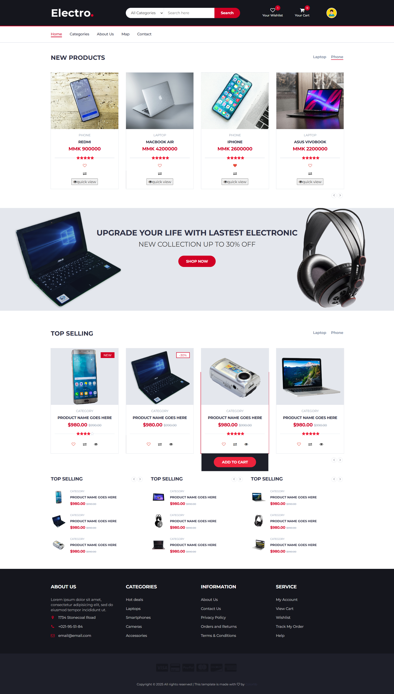

# Laravel Ecommerce System

A simple ecommerce system built with Laravel Framework.Customers can browse products, add items to cart and place orders.Admin can manage products,categories,orders and users.Owner can manage add new admin and delivery, payment method and create voucher code.

## Features
<li>User authentication (login(Google & GitHub)/register)</li>
<li>Products & Category management</li>
<li>Shopping cart and checkout</li>
<li>Order management</li>
<li>Payment </li>
<li>Delivery Management</li>

## Admin Dashboard
 

## User Page

